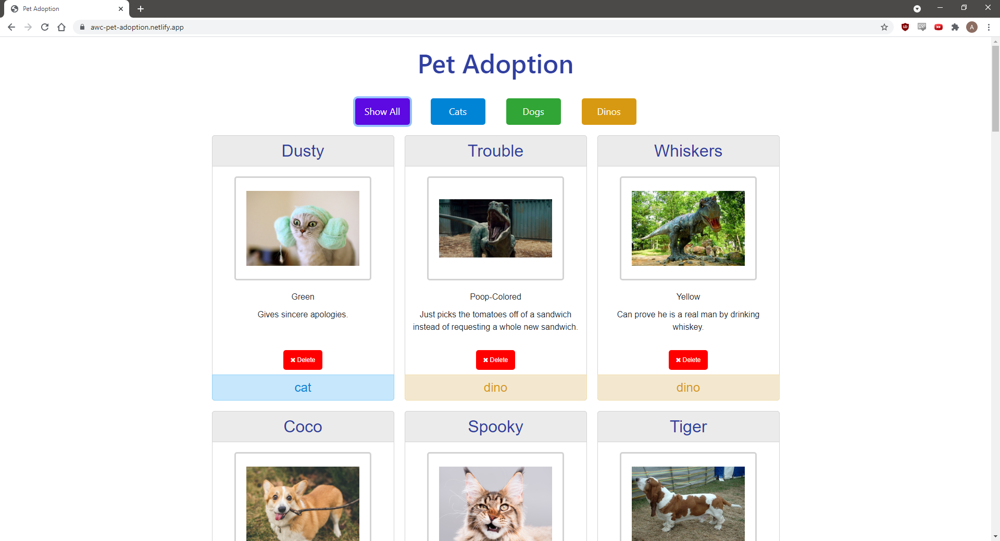
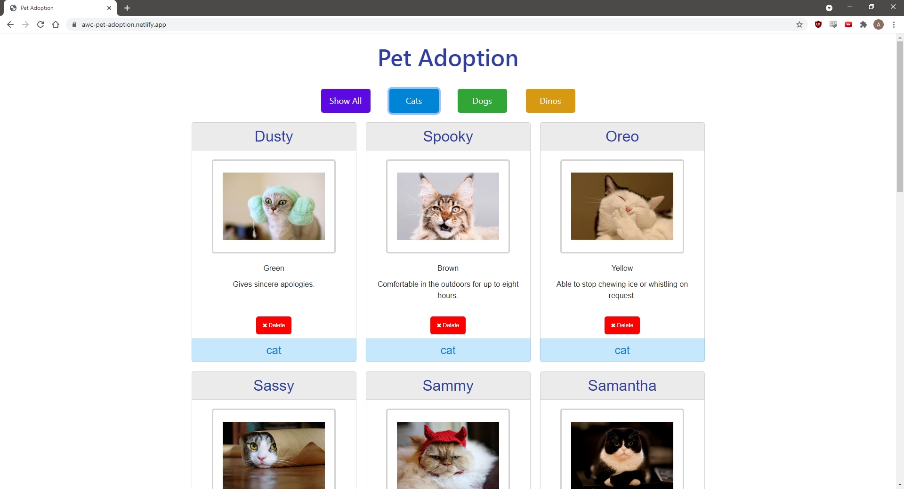
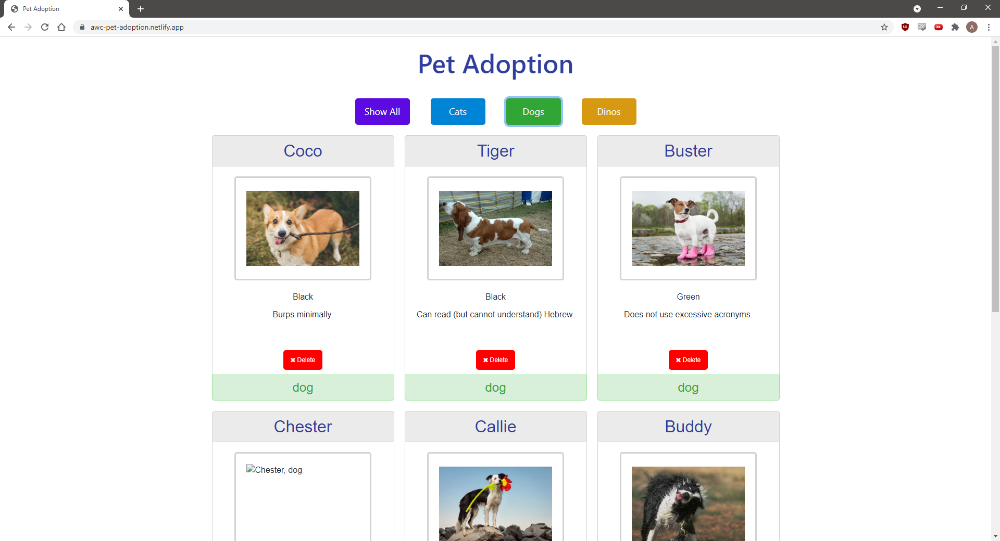
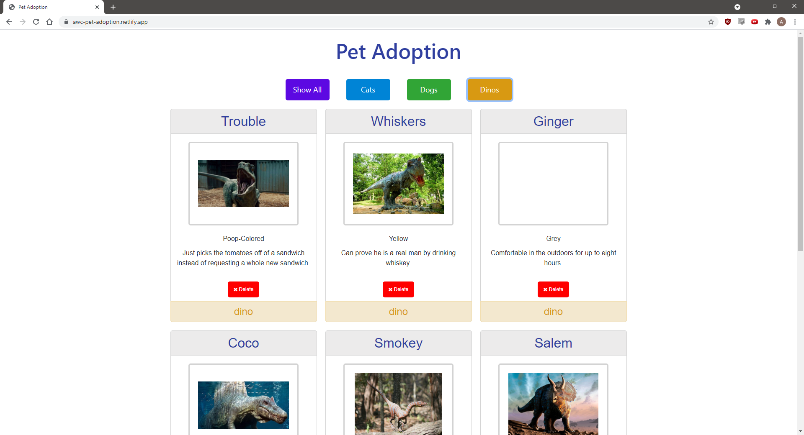

# Pet Adoption  [](https://app.netlify.com/sites/awc-pet-adoption/deploys)
<!-- update the netlify badge above with your own badge that you can find at netlify under settings/general#status-badges -->

The Pet Adoption project is focused on creating an array of objects and printing them to the DOM. The project utilizes loops, event listeners, and filter buttons all built within functions.

[View App](https://awc-pet-adoption.netlify.app)

## Get Started <!-- OPTIONAL, but doesn't hurt -->
```
$ git clone git@github.com:albertchitta/ASSIGNMENT-pet-adoption.git
$ cd ASSIGNMENT-pet-adoption
```
## About the User <!-- This is a scaled down user persona -->
- The ideal user for this application is someone managing a pet adoption website.
- They want to be able to filter through the pets and delete the ones that get adopted.
- The problem this app solves for them is it filters data to make it easy navigating through, potentially, a large number of pets.

## Features <!-- List your app features using bullets! Do NOT use a paragraph. No one will read that! -->
- The DOM will populate with filter buttons on top and all of the pets in the array.
- Filter Buttons: There are four buttons (Show All, Cats, Dogs, and Dinos) that will filter each type of pet.
- Pet Colors: The color of each pet's card changes depending on the type of pet.
- Delete Button: A delete button is used to remove a pet from the array and the DOM.

## Video Walkthrough of Pet Adoption <!-- A loom link is sufficient -->
https://www.loom.com/share/ba38ea11daa94efdaae1e5a36b8e4508

## Relevant Links <!-- Link to all the things that are required outside of the ones that have their own section -->
- [Check out the deployed site](https://awc-pet-adoption.netlify.app)

## Code Snippet <!-- OPTIONAL, but doesn't hurt -->
This function deletes a pet from the array and prints it to the DOM. It will also keep you on the current filter selection.
```
// Deletes the pet card
const deletePet = (event) => {
  const targetId = event.target.id;
  const targetType = event.target.type;

  if (currentPage !== "all" && targetType === "button") {   // Check if the pets have been filtered and the delete button was pressed
    const tempArray = pets.filter(pet => pet.type === currentPage);   // Filter the pets again and assign it to a temporary array
    for (let i = 0; i < pets.length; i++) {   
      if (pets[i] === tempArray[targetId]) {    // Loop through the main array to find the pet in the filtered array
        tempArray.splice(targetId, 1);    // Delete the pet from the filtered array
        pets.splice(i, 1);    // Delete the pet from the main array
        petBuilder(tempArray);    // Rebuild the filtered page
        break;    // Break out of the loop
      }
    }
  } else if (targetType === "button") {   // Check if the pets were not filtered and the delete button was pressed
    pets.splice(targetId, 1);   // Delete the pet from the main array
    petBuilder(pets);   // Rebuild the main page
  }
};
```

## Project Screenshots <!-- These can be inside of your project. Look at the repos from class and see how the images are included in the readme -->





## Contributors
- [Albert Chittaphong](https://github.com/albertchitta)
